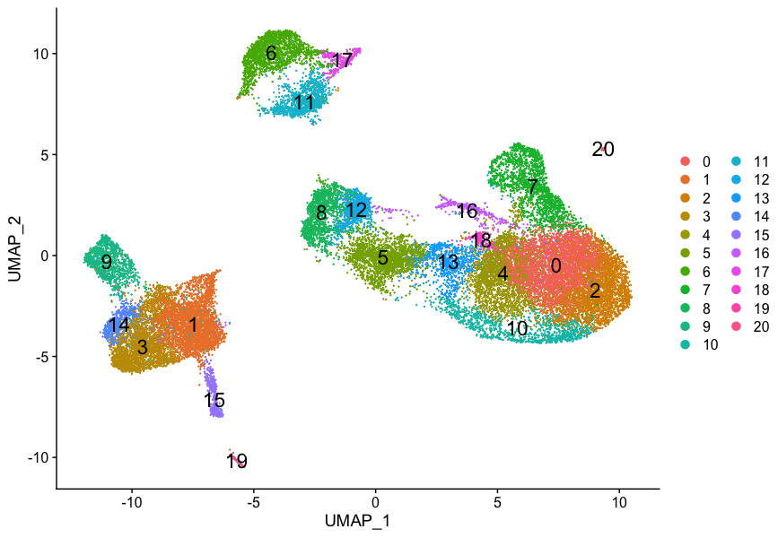
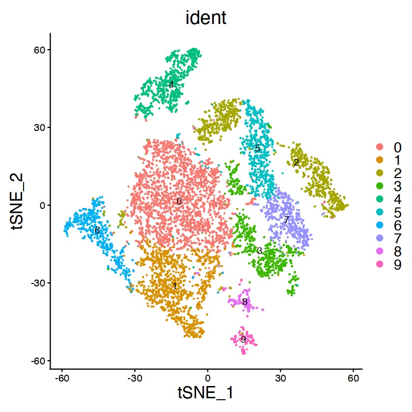
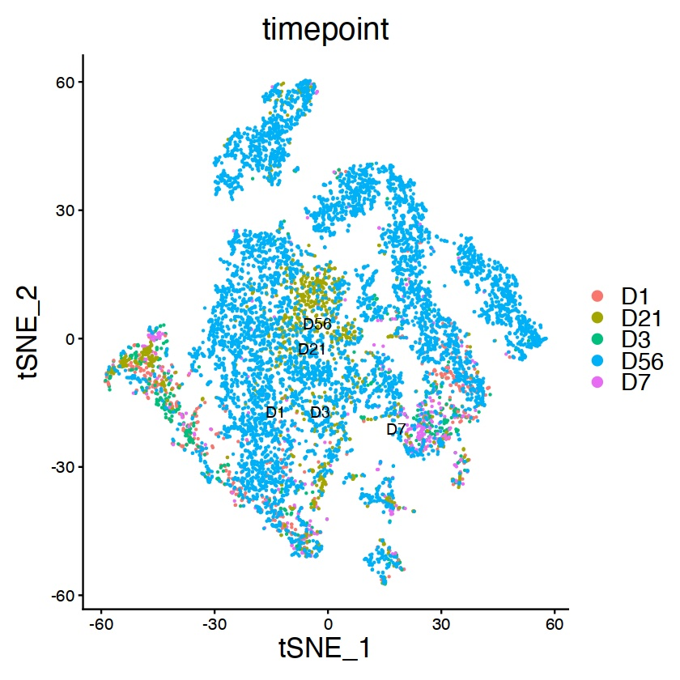
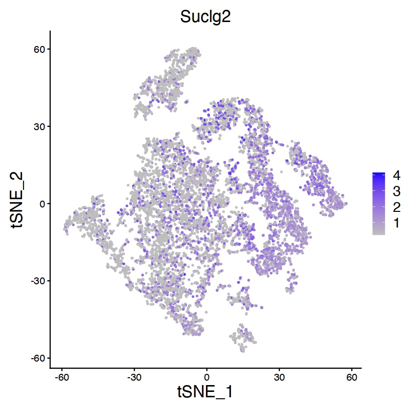
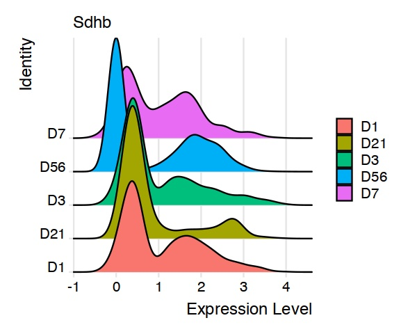
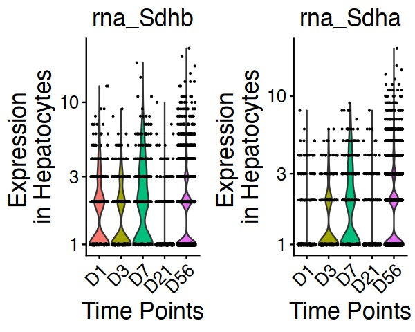

# BENG183project
# scRNA-seq
## Purpose

## Upstream 


## Downstream
### Quality Check

### Seurat
After the quality check, we first preprocess the data, then perform differential expression analysis and dimension reduction. 

#### Preprocessing
```
Dev_NPC <- NormalizeData(object = Dev_NPC, normalization.method = "LogNormalize", scale.factor = 10000)
Dev_NPC <- FindVariableFeatures(Dev_NPC, selection.method = "vst", nfeatures = 2000)
Dev_NPC <- ScaleData(Dev_NPC, vars.to.regress = c("nCount_RNA","percent.mt"), features = row.names(Dev_NPC))
```
This is the preprocessing R code. ```Dev_NPC``` is a Seurat object.

```
Dev_NPC <- NormalizeData(object = Dev_NPC, normalization.method = "LogNormalize", scale.factor = 10000)
```
For preprocessing, The input count matrix has large variations between rows and columns. To level the inputs, we use log normalization (the default normalizing method).
```
Dev_NPC <- FindVariableFeatures(Dev_NPC, selection.method = "vst", nfeatures = 2000)
```
Then, we use ```FindVariableFeatures()``` to find the 2000 best genes for next steps. We chose the default selection method ```vst```, so we decide the better genes will have larger variability in the count matrix, and thus we will have better PCA results. This process is calculated by standardizing the feature values using the observed mean and expected variance.
```
Dev_NPC <- ScaleData(Dev_NPC, vars.to.regress = c("nCount_RNA","percent.mt"), features = row.names(Dev_NPC))
```
By scaling data, we perform feature-level scaling. Each feature will have a mean of 0 and scaled by its standard deviation, which means it is regressed. Then, we scale and center the residues.

#### Dimension Reduction
_Why do we perform Dimension Reduction?

The count matrix is a multidimensional data set, which is very hard to explore the inner patterns (especially for human eyes!!). If you remember the beautiful figures in papers like this:



This is a example result of dimension reduction. By using Seurat, we can visualize the count matrix using two most significant dimensions, and achieve clusters automatically. After this, we can find marker genes for each cluster and determine what they represent. As in UMAP plots, the general structure and distances between clusters also contains information, we are able to generate rich analysis results using Dimension Reduction.

```
Dev_NPC <- RunPCA(Dev_NPC, features = VariableFeatures(object = Dev_NPC), verbose = FALSE, npcs = 100) 
```

The key step of dimension reduction is PCA -- Principal Component Analysis. With PCA we find independent and separated features and prepare for clustering. 
```
Dims <- 30
Dev_Hep <- FindNeighbors(Dev_Hep, dims=1:Dims)
Dev_Hep <- FindClusters(Dev_Hep, resolution=0.3) #resolution 0.3
```
After we reduce the data to 2 dimensions, we need to generate the clusters based on the separated data. Luckily, Seurat automatically generates clusters with two methods: ```FindNeighbors()``` and ```FindClusters()```. In ```FindNeighbors()```, Seurat applies a Shared Nearest Neighbor algorithm to decide the similarity between cells. It is a updated KNN algorithm with the shared nearest similarity calculated. After we draw the plot, we identify the plot by dividing the data points to clusters. The Louvain Method is adopted here in ```FindClusters()```. Though the clusters are generated by algorithm, we can change the number of clusters by changing the resolution -- just like zooming in and out.
```
Dev_Hep <- RunTSNE(Dev_Hep, dims = 1:Dims, tsne.method = "Rtsne", nthreads = 8, max_iter = 2000)
Dev_Hep <- RunUMAP(Dev_Hep, dims = 1:Dims)
```

To visualize the dimension reduction result and clusters, we mainly have two methods: tSNE or UMAP to better separate and visualize the clusters.. They both reduce higher dimensional data to two dimensions and then we plot clusters with the data. UMAP is the newer and more comprehensive tool, which is better based on mathematical induction than tSNE. When we compare UMAP and tSNE plots, UMAP uses cross-entropy loss as loss function and results in a more authentic general structure. It is also much faster than tSNE, especially on large data sets.





This is a example of visualizing tSNE-based clusters. We can see this plot with first, clusters based on identities and second, clusters based on timeline. When we compare the two plots, we can understand how the different clusters of cells change with respect to time.



We can use more ways to visualize the dimension reduction analysis. For example, we can use marker genes (The _Feature_) and show their concentration among the clusters. Suclg2 is a marker gene of mitochondria TCA cycle, so we can see its distribution in the clusters and assume the functional relationship between different clusters of cells and mitochondria activities.




RidgePlots and ViolinPlots are used in showing the expression level differences between days or features.

#### Differential Expression Analysis

Another section of Single-cell Sequencing analysis is differential expression (just like bulk RNA sequencing). To find Differentially Expressed genes, we have a convenient method: ```FindAllMarkers()```. It calculates the DE genes in each cluster and we can save the result in a csv file, just like the DESeq2 result.


The difference, or advantage we get from single-cell sequencing compared to bulk RNA sequencing is that we can get information about each type of cell instead of all cells mixed. Seurat has designed multiple tools to utilize this advantage.

The Seurat toolkit updates fast, so some methods with similar functions (i.e. ```FindMarkers``` and ```FindAllMarkers```) have been used in different time periods. Make sure to consult the current [Seurat reference page](https://satijalab.org/seurat/reference/index.html) for advice!

In conclusion, single-cell sequencing provides differentially expressed genes and classify functions with different clusters of cells.
